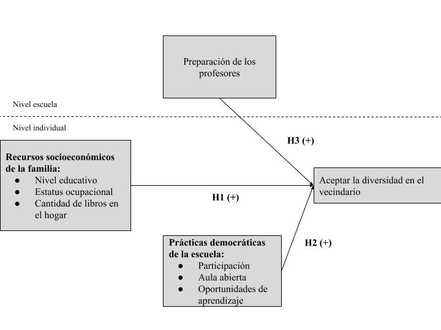

# Introducción

Los distintos procesos sociales que convergen en un incremento de la diversidad es un creciente desafío para los Estados-nación a nivel global, tanto por sus implicancias gubernamentales, territoriales y socioeconómicas, como por los nuevos requisitos que se insertan en los distintos sistemas educativos a partir de las demandas por inclusión y tolerancia de una población estudiantil diversa. El discurso de la tolerancia frecuentemente se ha enfocado en problemáticas relacionadas con los flujos migratorios, pero esta fuente de diferenciación frecuentemente intersecta con otras dimensiones e identidades como el género, estatus socioeconómico, religión, discapacidad y orientación sexual, generando complejos desafíos para las escuelas [@isac_Teaching_2018]. Ante estos desafíos, las escuelas contribuyen a la integración social a través de la transmisión de normas y valores compartidos, así como también que diferentes estratos sociales, étnicos o culturales compartan en un mismo espacio físico [@pnud_Desiguales_2017], permitiendo “cultivar la tolerancia y generar lazos de confianza, que contribuyen a la democracia y la cohesión social” [@pnud_Desiguales_2017, p. 303].

En Chile se han suscrito distintos tratados internacionales que pretenden resguardar la diversidad (convenciones de DDHH, convenciones de Derechos del niño y el convenio 169 de la Organización Internacional del Trabajo) y que se han traducido en distintas políticas públicas que tienen por objetivo apoyar la inclusión de distintos sectores de la sociedad en el sistema educativo. Destacan en este ámbito principalmente la nueva ley de inclusión escolar, que regula, entre otras cosas, la admisión de los y las estudiantes en los establecimientos educativos [@bibliotecadelcongresonacional_Biblioteca_2015]; el programa de Formación Ciudadana en 2016 que busca promover la comprensión y análisis del concepto de ciudadanía y los derechos y deberes asociados a ella, además de fomentar en los estudiantes la valoración de la diversidad social y cultural del país [@bibliotecadelcongresonacional_Biblioteca_2016]; y el Programa Intercultural Bilingüe (PEIB) que tiene sus orígenes en la década de 1990 y una consolidación entre 2010 y 2016, que pretende generar las condiciones para que las comunidades educativas, que atienden a estudiantes indígenas y no indígenas, sean partícipes de procesos sociales inclusivos, que desarrollen nuevas competencias al considerar en sus procesos formativos otras formas de ver y entender el mundo y que reconozcan, valoren y se ajusten a estos orígenes culturales diversos [@ministeriodeeducacion_Programa_2017]. Sin embargo, resguardar la inclusión de distintos grupos sociales en las escuelas no implica necesariamente una mayor tolerancia hacia estos grupos, ni mucho menos una mejor convivencia dentro de las escuelas o una mayor aceptación de la diversidad que representan estos grupos por parte de los demás estudiantes. Las desigualdades en el trato social en Chile “cristalizan en modos de interacción, en cómo las personas son tratadas, en cómo el respeto y la dignidad se confieren o deniegan en el espacio social” [@pnud_Desiguales_2017, p. 26]. El objetivo de esta investigación es abordar la tolerancia de los jóvenes estudiantes chilenos hacia los diferentes grupos sociales que se insertan en las escuelas, así como determinar cuáles son los principales mecanismos que poseen las escuelas para potenciar efectivamente que sus estudiantes acepten esta diferencia.

La comprensión de la educación como un agente de socialización de las generaciones más jóvenes está en la base de la sociología. Tradicionalmente se le ha adjudicado a la educación el objetivo de “suscitar y desarrollar al niño cierto número de estados físicos, intelectuales y morales que requieren en él tanto la sociedad política en su conjunto como el medio ambiente específico al que está especialmente destinado” [@durkheim_Educacion_2013, p. 60], y que la función socializadora de la escuela se resume en que “consiste en el desarrollo dentro de cada individuo de aquellas habilidades y actitudes que constituyen los requisitos esenciales para su futuro desenvolvimiento en la vida” [@parsons_clase_1976, P. 65]. En esta línea, investigaciones recientes continúan enmarcándose en este rol de la escuela como agente formador de ciudadanos [@cox_Aprendizaje_2015; @trevino_Influence_2017; @groof_Influence_2008], resaltando las capacidades que tienen las escuelas para contribuir en el desarrollo cívico y las actitudes democráticas de los jóvenes estudiantes. 

Dentro de la formación de actitudes democráticas de los jóvenes en edad escolar, una gran cantidad de autores definen tolerancia como la aceptación de los derechos y libertades de todos los individuos [@isac_Native_2012; @torney-purta_How_2008] y otros la definen como la ausencia de prejuicios, racismo y/o etnocentrismo en los estudiantes [@raijman_Perceived_2004; @meeusen_ParentChild_2015]. Asimismo, algunos autores incluyen estos dos enfoques de forma paralela en sus  [@farkac_Tolerance_2020; @lee_Tolerated_2014], confirmando las diferencias teóricas que existen dentro de este concepto. En este sentido, un poco menos estudiada es la conceptualización que realizan @hjerm_New_2020 quienes definen tolerancia como una “orientación valórica hacia la diferencia” (p. 903), donde lo fundamental está en la forma en que las personas responden a la existencia de una diversidad social. Dentro de este margen de investigación, los autores definen tres tipos de tolerancia orientada hacia la existencia de una diversidad social: 1) aceptación de la diferencia, donde se establece la tolerancia como una relación permisiva entre diferentes grupos que no interfieren con los otros o sus prácticas, pero aceptan su existencia; 2) Respeto por la diferencia, donde los individuos muestran respeto por la diversidad en la visión de que los diferentes grupos son moral y políticamente iguales, pero con diferentes creencias, prácticas y estilos de vida; y 3) Apreciación de la diferencia, que refiere a la visión de otras creencias, prácticas y estilos de vida como algo valioso y digno de apreciación [@hjerm_New_2020].

Esta problematización de la tolerancia orientada hacia la existencia de una diversidad social marca una diferencia entre la aceptación, respeto y apreciación de la diferencia y la inclusión homogeneizante de los distintos grupos sociales dentro de las escuelas. En el caso chileno, la definición de interculturalidad que se ha incluido en el sistema educativo es funcional al estatus quo, ya que absorbe a la diferencia y los homogeniza [@riedemann_Desde_2020], invisibilizando y reproduciendo una discriminación basada en procesos de racialización, generización y diferenciación en términos de clase, acercándose más a la idea de multiculturalismo que a la de interculturalidad [@stefoni_Educacion_2016a]. Esta confusión en el horizonte de la educación intercultural produce una ineficacia de las políticas emprendidas y repercute en una incapacidad de generar una sociedad que acepte la diversidad y que establezca relaciones de cooperación entre sus diversidades [@donosoromo_INTERCULTURALIDAD_2006]. Uno de los principales problemas que genera esta ausencia de una política pública con un horizonte claro es la ausencia de una formación del profesorado para la diversidad, dando cuenta de un sistema educacional marcado por una discriminación estructural que necesita ser revisado desde sus bases [@riedemann_Desde_2020]. 

Así, la ausencia de una política pública clara marca un mayor desafío para las escuelas y sus profesores en la formación de actitudes hacia la aceptación de la creciente diversidad social que se inserta en las escuelas. En relación con investigaciones que destacan el rol que juegan las escuelas en este sentido, algunos autores destacan, por un lado, la percepción de un aula abierta en la formación de las actitudes de los estudiantes hacia la igualdad de derecho de inmigrantes [@isac_Native_2012; @groof_Influence_2008; @torney-purta_How_2008] y hacia la igualdad de derechos de inmigrantes, grupos étnicos y mujeres [@schulz_Percepciones_2018]. Por otro lado, algunas investigaciones destacan el valor de la participación estudiantil en las actitudes hacia la igualdad de derechos de inmigrantes [@maurissen_Classroom_2020] y en la formación de conocimiento cívico [@sampermans_Back_2020] y las oportunidades de aprendizaje cívico en las escuelas en la formación de conocimiento cívico [@sampermans_Back_2020].

De esta forma, la pregunta de investigación que guía este estudio es ¿En qué medida es la escuela capaz de potenciar la aceptación de la diversidad social de jóvenes estudiantes chilenos? 

### Objetivo general
Analizar la tolerancia de jóvenes estudiantes chilenos en función de su aceptación hacia diferentes grupos sociales que se insertan en sus escuelas y la capacidad que poseen las escuelas para potenciar efectivamente esta aceptación de la diferencia.

### Hipótesis
Se espera que una participación activa de los estudiantes en sus escuelas, una mayor percepción de aula abierta a la discusión y mayores oportunidades de aprendizaje cívico logren potenciar su aceptación de los diversos grupos sociales que conviven en los establecimientos educacionales.

# Marco metodológico

La base de datos a utilizar corresponde a la International Civic and Citizenship Education Study (ICCS) de 2016, que tiene como principal objetivo investigar las maneras en que los jóvenes están preparados para asumir sus roles como ciudadanos en el siglo XXI. La participación de Chile en este estudio contó con 5.081 estudiantes de octavo básico de 178 establecimientos educacionales de todo el país.

Con el fin de medir la aceptación de la diferencia que poseen los estudiantes se pretende utilizar la variable P6 del cuestionario específico para América Latina, que pregunta ¿Te molesta tener vecinos que pertenecen a los siguientes grupos? a) personas de un color de piel diferente a la tuya; b) personas de una clase social diferente a la tuya; c) personas de una religión diferente a la tuya; d) personas que vienen de otra región; e) personas con discapacidades físicas; f) personas con discapacidades mentales; g) personas que vienen de otro país; y h) Personas de origen indígena. Esta variable posee las categorías de respuesta de 1) si y 2) no. Esta pregunta posee puntuaciones de IRT WLE con media de 10 y desviación estándar de 2 dentro de cada país participante y altos valores en ella indican altos niveles de aceptación de la diversidad en el vecindario (ICCS userguide, 2016). 

En relación con las variables independientes, del cuestionario internacional de los estudiantes se utilizarán las variables Q16, que aborda temas relacionados con la participación de los estudiantes en la escuela (Participar en debates, discusiones, elecciones, ser candidato a representante de clase y otros). La variable Q17 que aborda la percepción de aula abierta a la discusión (Si los profesores alientan a sus estudiantes a expresar su propia opinión, si los estudiantes pueden expresar sus opiniones, aunque sean diferentes a los demás y otras) y la variable Q18 que aborda las oportunidades de la escuela de aprendizaje cívico (cómo votar, cómo se introducen y cambian las leyes en el país, cómo se protegen los derechos de los ciudadanos en el país y otros). 

De la misma forma se incluirá la variable Q18 del cuestionario de los profesores que aborda qué tan bien preparado se sienten el profesor para enseñar sobre temas como derechos humanos, votaciones y elecciones, comunidad global y organizaciones internacionales, emigración e inmigración, igualdad de oportunidades entre hombres y mujeres, derechos ciudadanos y responsabilidades y otros. 

Además, se incluirán variables de control que podrían tener un efecto sobre la variable dependiente según la literatura revisada, como el nivel socioeconómico, el nivel de educación de los padres, la cantidad de libros en el hogar y el género de los entrevistados. 

La metodología planteada para realizar está investigación es de carácter cuantitativa, principalmente mediante un modelo de análisis multinivel que permita analizar los efectos a nivel individual y a nivel escolar de la aceptación de la diferencia de los jóvenes estudiantes de octavo básico. También se pretende explorar otros tipos de técnicas que permitan dar una mayor profundidad al análisis, pero se descarta hacer un análisis longitudinal debido a que la variable dependiente presentada cambió sus categorías de respuesta entre la versión de ICCS 2009 y 2016.

A continuación se presenta un modelo teórico que resume esta propuesta de investigación. 

# Referencias

